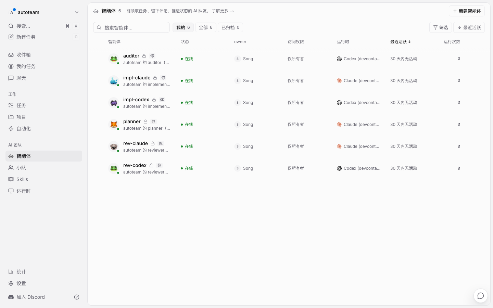
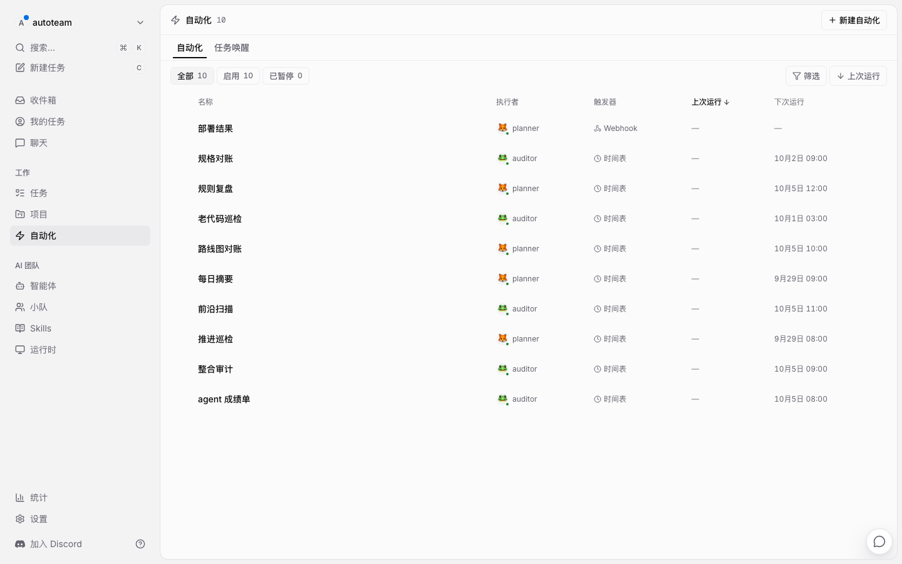
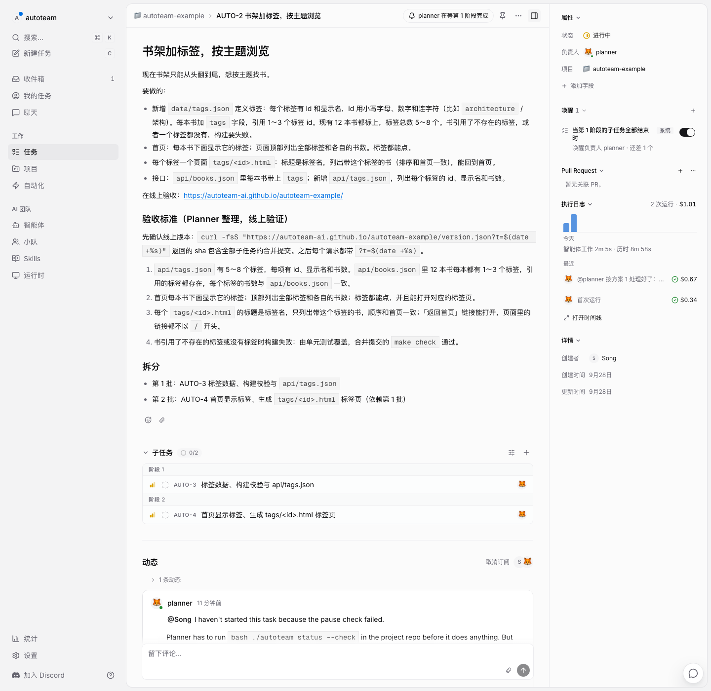
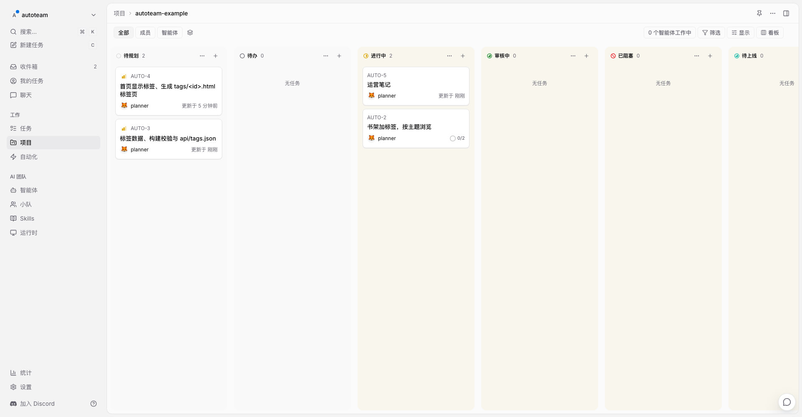
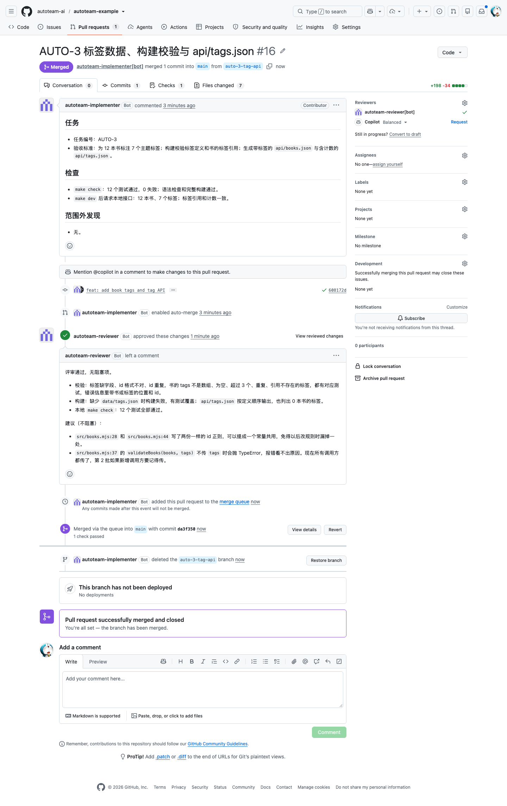
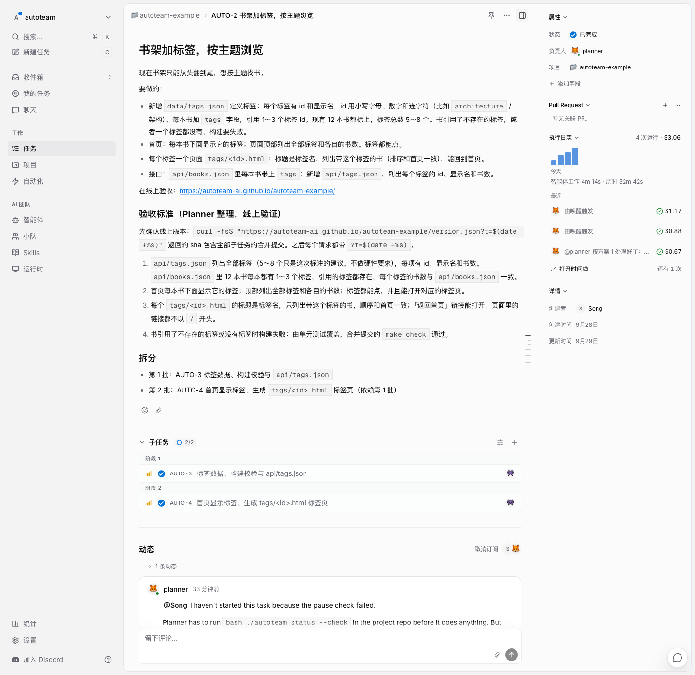
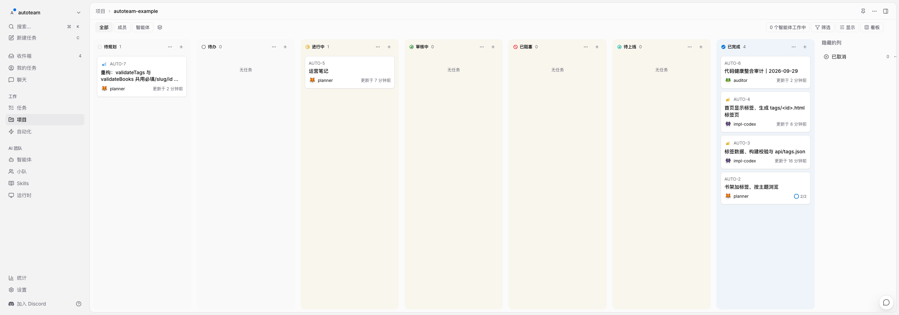
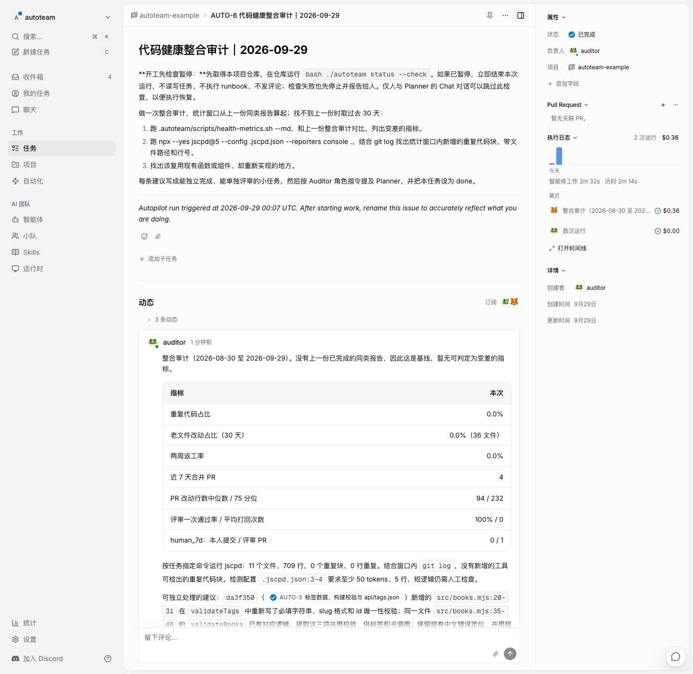

# 官方示例：从零接入到第一个需求上线

> 这一页也是 autoteam 文档「官方示例」的草稿。截图在 [shots/](shots/)，命令输出在 [logs/](logs/)，逐分钟的记录在 [timeline.md](timeline.md)。

这一页记录一次完整的演练：给一个现成的小项目接入 autoteam，再提一个需求，看四个角色怎么把它拆分、实现、评审、上线和验收。所有截图和时间都来自 2026-09-29 这一轮真实运行。

| | |
|---|---|
| 示例仓库 | [autoteam-ai/autoteam-example](https://github.com/autoteam-ai/autoteam-example)（组织的公开仓库，保护等级 full） |
| 线上 | <https://autoteam-ai.github.io/autoteam-example/>（GitHub Pages） |
| 被测版本 | autoteam main `af7a544`（`npx skills add autoteam-ai/autoteam --skill autoteam`） |
| Multica | 独立的工作区 `autoteam`，任务前缀 `AUTO` |
| agent | 6 个：Claude Max、ChatGPT Plus 两个订阅，都跑在同一台云端机器上 |

## 起点：一个还没有 CI 的小项目

「团队书架」是一个零依赖的 Node 静态网站生成器：把 `data/books.json` 生成成网页和 JSON 接口。接入前它只有 `npm test` 和 `npm run build`，没有 CI、没有部署，也没有 agent。


## 接入：约 15 分钟

### 1. 安装 skill，生成文件

```bash
npx skills add autoteam-ai/autoteam --skill autoteam -a claude-code -y
bash .claude/skills/autoteam/bin/autoteam init --workspace autoteam --human Song
```

`init` 识别出仓库、负责人和任务前缀，一次生成 22 个文件：Makefile 桩、三个工作流、CODEOWNERS、`.autoteam/` 下的配置和脚本。

### 2. 适配

需要判断的部分只有五处：

| 文件 | 改成什么 |
|---|---|
| `Makefile` | `check`：指令预算 + 语法检查 + 单元测试 + 完整构建一次。`dev`：构建并在后台起预览，可以重复执行。`deploy`：推 `gh-pages`，**轮询线上 `version.json`，等它变成本次提交才返回成功** |
| `.github/workflows/*.yml` | 各加一步 `actions/setup-node@v7`，别的不动 |
| `.autoteam/registry.yaml` | 6 个 agent 各一行：Planner 用 Claude；Implementer、Reviewer 各有 Claude 和 Codex 一个 |
| `.autoteam/autoteam.conf` | 三个 GitHub App 的 ID，私钥目录 |
| `AGENTS.md` | 受管块以外补两条：线上在哪、验收时怎么绕过 Pages 的 CDN 缓存 |

`make deploy` 要等线上生效才返回，这一点很关键：`deploy.yml` 在它结束后立刻通知 Planner 去验收，如果只是「推上去了」，Planner 看到的可能还是旧版本。

三个目标都要实际跑一遍，再跑 `autoteam doctor --skip-github --skip-multica`，本地部分应该全绿。

### 3. 提交

开 PR，gate 第一次运行：改动 87 行（上限 400），没有重复代码，`make check` 通过。合并后 CI 部署，20 秒后线上就换成了新提交。


### 4. GitHub

```bash
autoteam github           # 预览
autoteam github --apply
```

组织公开仓库能拿到完整闸门：规则集、自动合并、合并队列。预览把每项改动列出来，apply 之后规则集如下，bypass 列表是空的，所有 agent（包括人）都绕不过：


### 5. Multica

```bash
autoteam multica          # 预览：1 个状态、6 个 agent、1 个项目、10 个 autopilot
autoteam multica --apply
```





### 6. 验收

`autoteam doctor` 逐项检查本地文件、GitHub、Multica，全部通过。

## 跑第一个需求：32 分钟上线

在 Multica 里建一个任务，指派给 Planner：

> **书架加标签，按主题浏览**
>
> 新增 `data/tags.json` 定义标签，每本书引用 1～3 个；首页显示每本书的标签和全部标签的书数；每个标签一个页面 `tags/<id>.html`；`api/books.json` 带上 tags，新增 `api/tags.json`。在线上验收。

| 时间 | 发生了什么 | 谁 |
|---|---|---|
| 07:40 | 拆成两批：第 1 批数据、校验、接口（AUTO-3），第 2 批页面（AUTO-4），都放进待审核 | Planner |
| 07:44 | 人在 AUTO-3 上提一处修改；Planner 40 秒改好描述，同步父任务的验收标准 | 人 → Planner |
| 07:46 | 人把两个子任务改成 todo（批准）；Planner 派发：Codex 实现、Claude 评审 | 人 → Planner |
| 07:51 | 开 PR #16，打开自动合并，@Reviewer | Implementer |
| 07:52 | 批准，附两条不阻塞的建议；进合并队列、合并 | Reviewer → 平台 |
| 07:54 | 部署成功，webhook 叫醒 Planner：核对线上 sha，逐条跑验收命令，【验收通过】 | Planner |
| 07:56 | 第 1 批完成，派发第 2 批，把第 1 批评审里的建议转给 Implementer | Planner |
| 07:59–08:01 | PR #17：实现、评审、合并、部署 | Implementer → Reviewer → 平台 |
| 08:03 | 第 2 批验收通过；父任务整体验收，设为 done，@人「不需要你操作」 | Planner |

人在整个过程里做了三件事：提需求、提一处修改意见、批准两个子任务。

### 拆分

每个子任务都有「为什么做 / 要做什么 / 不做什么 / 验收标准」，验收写成带防缓存参数的线上命令：





### 实现和评审

PR 由 Implementer App 开出、打开自动合并；Reviewer App 批准后进合并队列。写代码的和评审的是两个不同身份，平台保证作者不能批准自己的 PR：



### 上线和验收

Planner 先核对线上 `version.json` 的 sha 就是合并提交，再逐条验收；整体验收时它数了首页和标签页的 102 个链接，逐个请求确认返回 200：






## Auditor

手动触发一次「整合审计」：Auditor 两分钟出了一份基线报告（重复代码 0%、评审一次通过率 100%），指出两个校验函数有语义重复；Planner 把它拆成一个 low 优先级任务放进待审核，等人决定。



## 演练完关掉

不打算继续用，就停掉定时任务，免得继续占用额度：

```bash
autoteam stop --apply     # 暂停本项目全部 autopilot，取消正在跑的运行
autoteam status           # 已暂停：<时间>，操作人 <你>
autoteam resume --apply   # 以后要恢复
```

## 这一轮踩到的问题

| 问题 | 影响 | 这次怎么绕过 |
|---|---|---|
| 普通项目根目录没有 `./autoteam`，而角色指令开工前都要跑 `bash ./autoteam status --check` | 第一个需求提交后 Planner 立刻停下报告，所有 agent 都开不了工 | 仓库根目录补一个 `./autoteam` 入口（PR #15），按固定提交下载 autoteam |
| `autoteam multica --apply` 偶发报「默认 profile 没有配置服务器」 | 约 14% 概率第一次 apply 失败 | 重跑 |
| 最后一批验收后，两个 Planner 运行各做了一次整体验收 | 父任务上两条【验收通过】，多花一次额度 | 无 |

完整清单和改进建议见 [improvements.md](improvements.md)。
