# 官方示例：给一个小项目接入 autoteam，跑通第一个需求

> 这一页也是 autoteam 文档「官方示例」的草稿。截图在 [shots/](shots/)，命令输出在 [logs/](logs/)，带时间的记录在 [timeline.md](timeline.md)，导出的运行记录在 [evidence/](evidence/)。

这一页记录一次完整的演练：给一个现成的小项目接入 autoteam，再提一个需求，看四个角色怎么把它拆分、实现、评审、上线和验收。截图、时间和数字都来自真实运行。

| | |
|---|---|
| 示例仓库 | [autoteam-ai/autoteam-example](https://github.com/autoteam-ai/autoteam-example)（组织的公开仓库，保护等级 full） |
| 线上 | <https://autoteam-ai.github.io/autoteam-example/>（GitHub Pages） |
| 被测版本 | autoteam main `f1dc4b5`（`npx skills add autoteam-ai/autoteam --skill autoteam`） |
| Multica | 独立的工作区 `autoteam`，任务前缀 `AUTO` |
| agent | 6 个：Claude Max、ChatGPT Plus 两个订阅，都跑在同一台云端机器上 |

## 起点：一个还没有 CI 的小项目

「团队书架」是一个零依赖的 Node 静态网站生成器：把 `data/books.json` 生成成网页和 JSON 接口。接入前它只有 `npm test` 和 `npm run build`，没有 CI、没有部署，也没有 agent。

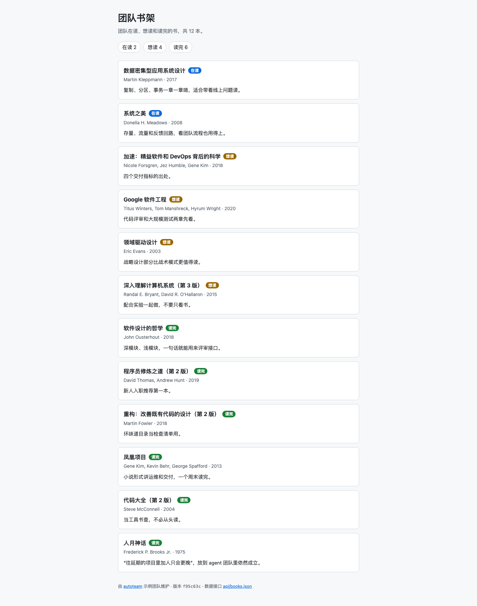

## 接入

### 1. 安装 skill，生成文件

```bash
npx skills add autoteam-ai/autoteam --skill autoteam -a claude-code -y
bash .claude/skills/autoteam/bin/autoteam init --workspace autoteam --human Song
```

`init` 识别出仓库、负责人、任务前缀和部署 environment，一次生成 24 个文件（[logs/01-init.log](logs/01-init.log)）：Makefile 桩、三个工作流、CODEOWNERS、`.autoteam/` 下的配置和脚本，以及根目录的 `./autoteam` 入口。agent 每次开工都会跑 `bash ./autoteam status --check`，入口把 autoteam 固定在当前版本的提交上，新 checkout 会自动下载。`.gitignore` 的受管块已经忽略了 skill 的安装目录，`git add -A` 不会把它提交进去。

### 2. 适配

需要判断的部分只有五处：

| 文件 | 改成什么 |
|---|---|
| `Makefile` | `check`：指令预算 + 语法检查 + 单元测试 + 完整构建一次。`dev`：构建并在后台起预览，可以重复执行。`deploy`：推 `gh-pages`，**轮询线上 `version.json`，等它变成本次提交才返回成功** |
| `.github/workflows/*.yml` | 各加一步 `actions/setup-node@v7`，别的不动 |
| `.autoteam/registry.yaml` | 6 个 agent 各一行：Planner 用 Claude；Implementer、Reviewer 各有 Claude 和 Codex 一个 |
| `.autoteam/autoteam.conf` | 三个 GitHub App 的 ID，私钥目录。语言（`AUTOTEAM_LANGUAGE=zh-CN`）和默认启用的 autopilot 用模板的默认值 |
| `AGENTS.md` | 受管块以外补两条：线上在哪、验收时怎么绕过 Pages 的 CDN 缓存 |

`make deploy` 要等线上生效才返回，这一点很关键：`deploy.yml` 在它结束后立刻通知 Planner 去验收，如果只是「推上去了」，Planner 看到的可能还是旧版本。

三个目标都要实际跑一遍（[logs/02-*](logs/)），再跑 `autoteam doctor --skip-github --skip-multica`：本地部分全绿，其中一项是在干净的 checkout 里把 agent 开工时要跑的 `bash ./autoteam status --check` 先跑一遍（[logs/04-doctor-local.log](logs/04-doctor-local.log)）。

### 3. 提交

开 PR，gate 第一次运行：行数上限、重复代码、`make check` 都通过。合并后 CI 部署，线上换成了新提交。

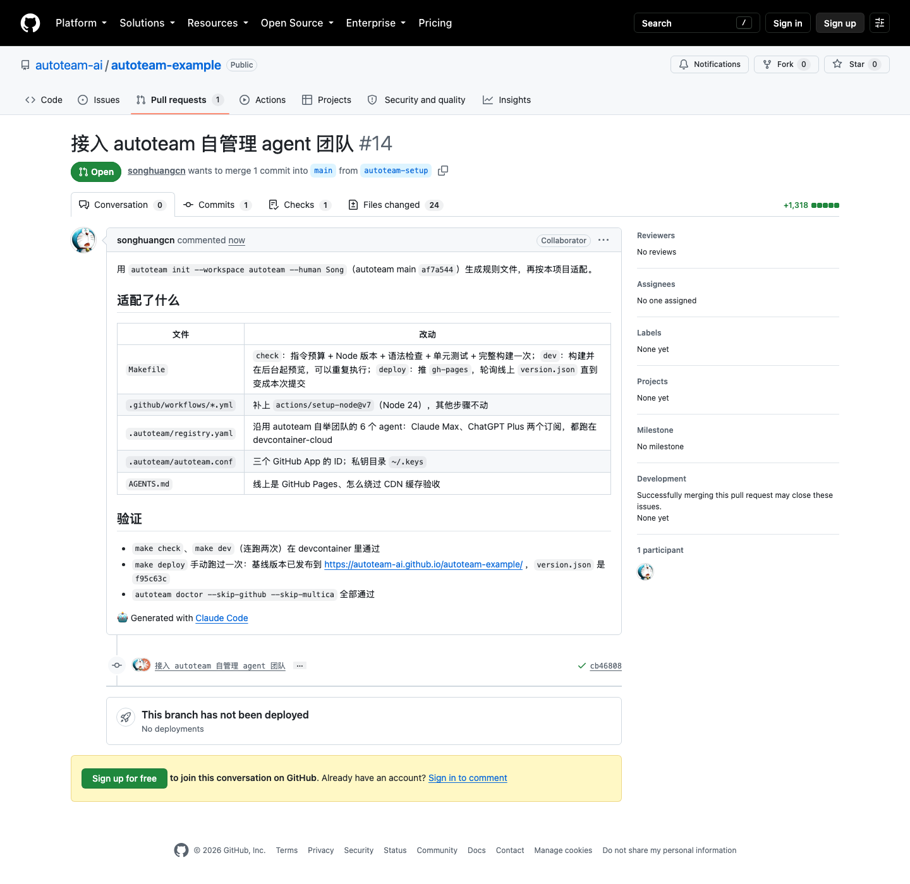

### 4. GitHub App

autoteam 用三个 GitHub App 作为三种身份：Implementer 推代码、开 PR；Reviewer 批准；Planner 只读代码、触发回滚。写代码的和评审的必须是两个 App，平台才能保证作者不能批准自己的 PR。

没有 App 时，`autoteam github --create-apps --apply` 用 GitHub App Manifest 流程建：每个角色在浏览器里打开一个带好权限的表单，人点一次确认，再把跳转后的地址粘回终端，私钥写进 `AUTOTEAM_KEYS_DIR`、App ID 写进 conf；装到仓库仍由人在 App 的 Install 页面点一次。这个示例复用组织里已有的三个 App，把 ID 填进 conf 即可。

### 5. 配置 GitHub 和 Multica：`autoteam setup`

```bash
bash ./autoteam setup            # 一次预览两边；交互终端里确认一次就执行
bash ./autoteam setup --apply    # 非交互环境直接执行
```

预览先列 GitHub（仓库设置、规则集、environment、三个 App 的安装和权限），再列 Multica（6 个 agent、1 个项目、运营笔记、默认的 5 个 autopilot、部署 webhook）（[logs/05-setup-preview.log](logs/05-setup-preview.log)）。确认后按 GitHub → Multica → doctor 执行（[logs/06-setup-apply.log](logs/06-setup-apply.log)）。

组织公开仓库能拿到完整闸门：规则集、自动合并、合并队列。规则集的 bypass 列表是空的，所有 agent（包括人）都绕不过：

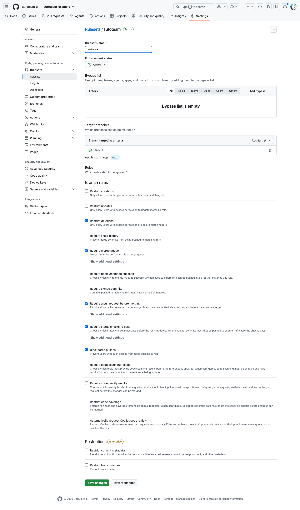

Multica 上是 registry 里的 6 个 agent，和默认启用的 5 个 autopilot：部署结果、推进巡检、每日摘要、规则复盘、周度健康报告。月度方向报告（前沿扫描 + 路线图对账）默认不开，需要时在 `AUTOTEAM_AUTOPILOTS` 里加上 `direction`。

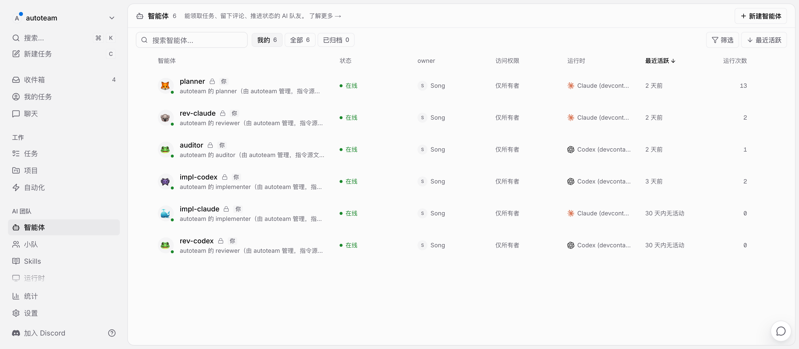

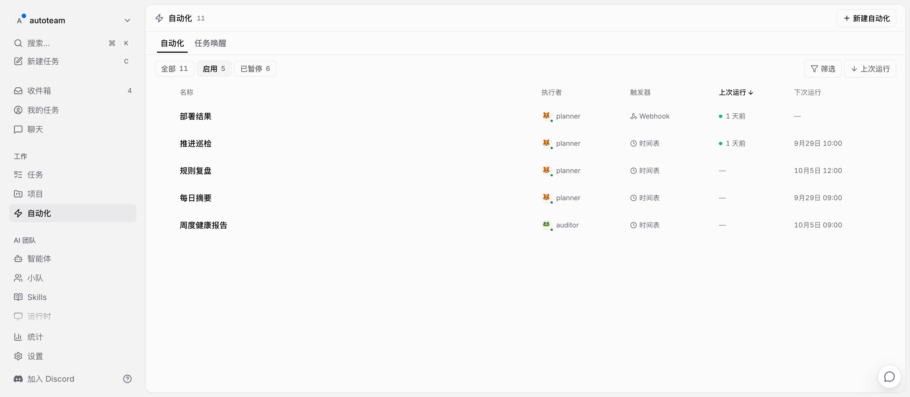

### 6. 验收

`setup` 最后自动跑的 doctor 逐项检查本地文件、GitHub、Multica：没有错误。GitHub 那一步对三个 App 各有一条 ⚠️（装在整个组织上），这个组织里别的仓库也在用它们，是预期的；doctor 的 5 条提醒是当时项目处于暂停状态，autopilot 都是 paused。

## 跑一个需求：11 分钟上线

在 Multica 里建一个任务，指派给 Planner（原文见 [requirement.md](requirement.md)）：

> **书架加作者页，按作者浏览**
>
> 作者从 `author` 字段拆出来，每位作者一个 id，重名要让构建失败；首页每位作者都能点；每位作者一个页面 `authors/<id>.html`；`api/books.json` 带上 `authors`，新增 `api/authors.json`。在线上验收。

| 时间 | 发生了什么 | 谁 |
|---|---|---|
| 07:32:42 | 提需求 AUTO-8 | 人 |
| 07:33:19 | 拆成一个子任务 AUTO-9，放进待审核，请人批准 | Planner |
| 07:35:26 | `autoteam approve AUTO-8 --apply`：放行，并确认 Planner 被叫醒 | 人 |
| 07:36:10 | 派发：Claude 实现、Codex 评审，理由写在评论里 | Planner |
| 07:37:15 | 开 PR #23（+121 −9，5 个文件），打开自动合并，@Reviewer；任务进入「审核中」 | Implementer |
| 07:39:44 | 批准；进合并队列 | Reviewer |
| 07:41:50 | 合并（a507e8b） | 平台 |
| 07:42:25 | 部署成功，通知 Planner：本次上线 `["AUTO-9"]` | CI |
| 07:42:56 | 线上逐条验收 AUTO-9，【验收通过】→ 已完成 | Planner |
| 07:43:19 | 批次屏障叫醒 Planner，父任务整体验收，【验收通过】→ 已完成，@人告知 | Planner |

人在整个过程里做了两件事：提需求，运行一次 `autoteam approve`。

### 拆分

子任务写清「为什么做 / 要做什么 / 不做什么 / 验收标准」，验收写成带防缓存参数的线上检查。Planner 估计改动远低于 400 行，就没有再拆批次：

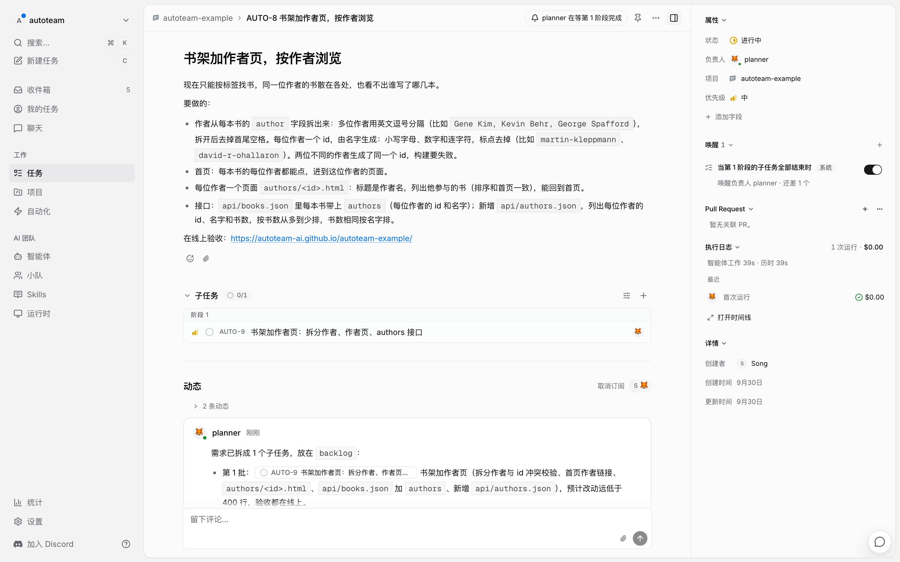

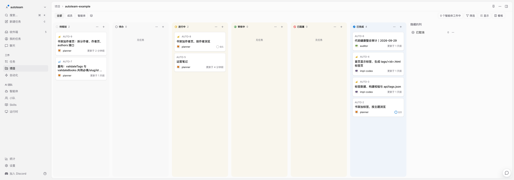

### 放行

```bash
bash ./autoteam approve AUTO-8           # 预览：每个子任务改成 todo，哪一个会叫醒 Planner
bash ./autoteam approve AUTO-8 --apply   # 执行，并核对 Planner 的运行已经生成
```

一个拆分有多批时，`approve` 把后续批次也一起放行但不叫醒 Planner，由批次屏障在前一批完成后叫醒它；人只批准一次（[logs/11](logs/11-approve-preview.log)、[logs/12](logs/12-approve-apply.log)）。

### 实现和评审

PR 由 Implementer App 开出、打开自动合并；Reviewer App 批准后进合并队列。写代码的和评审的是两个不同身份：

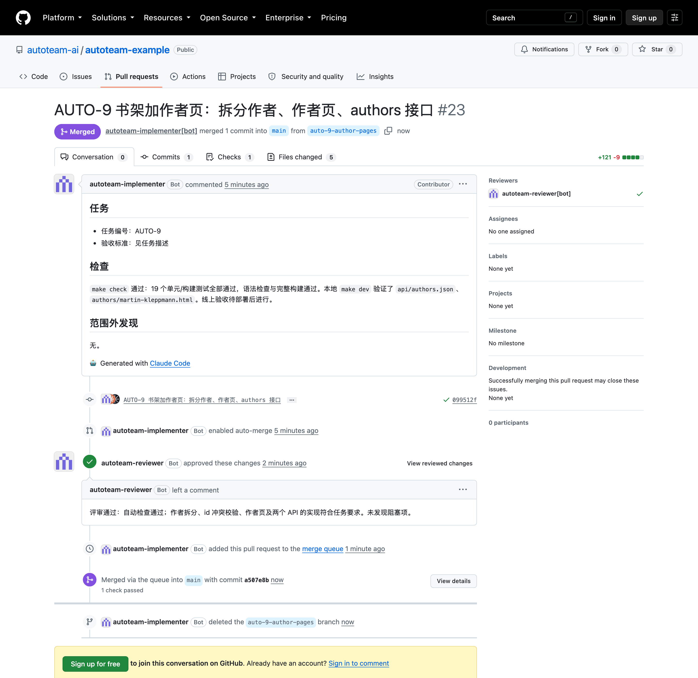

评审通过后任务停在「审核中」，等线上验收通过才算完成。看板上没有别的中间状态：

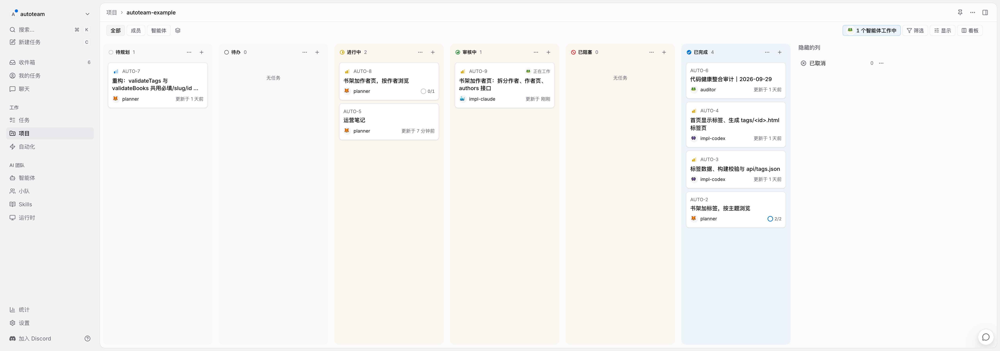

### 上线和验收

`deploy.yml` 在部署成功后算出「这次新上线了哪些任务」，放进通知里；没有新任务的部署不会叫醒 Planner：

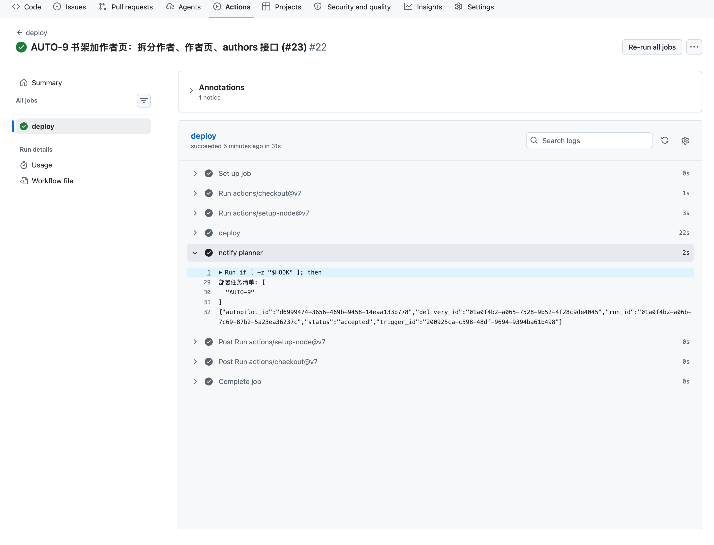

Planner 先核对线上 `version.json` 的 sha 就是合并提交，再逐条验收，只验收通知里的任务：

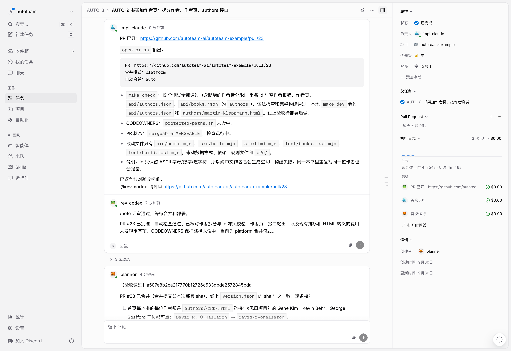

最后一批子任务完成后，批次屏障叫醒 Planner 做一次父任务整体验收，并告知人：

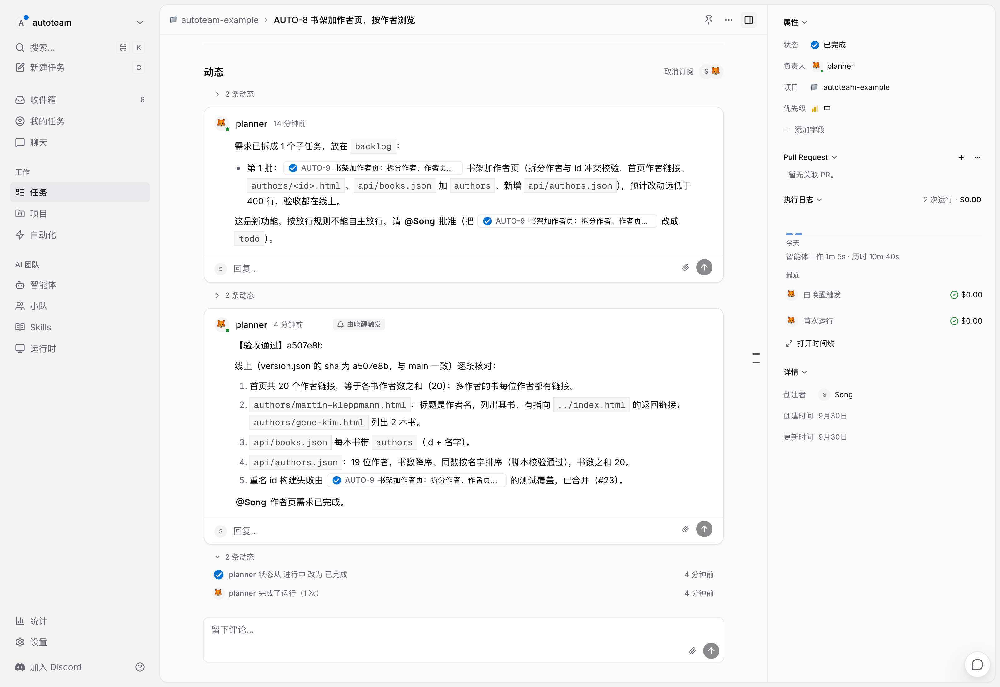


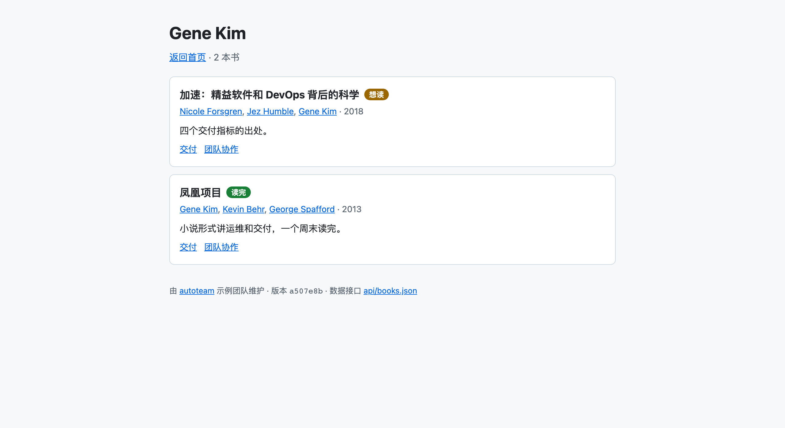

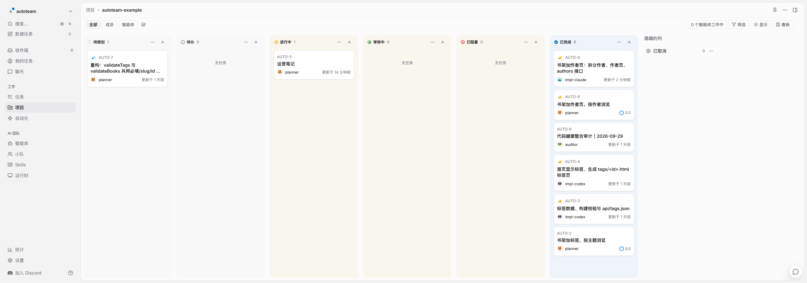

## 一直在跑的部分

默认的 5 个 autopilot：

| autopilot | 什么时候跑 | 做什么 |
|---|---|---|
| 部署结果 | 部署后有新上线任务时（webhook） | 线上验收这次上线的任务 |
| 推进巡检 | 每 2 小时 | 先跑 `autoteam next --check` 列出要处理的事，清单为空就直接结束 |
| 每日摘要 | 每天 9:00 | 过去 24 小时的进展、等人处理的事、放行核对、各 agent 的额度用量 |
| 规则复盘 | 每周一 12:00 | 回看人介入的地方，提规则改进 |
| 周度健康报告 | 每周一 9:00 | 整合审计、agent 成绩单、老代码巡检、规格对账合成一份 |

没事时的巡检：`next --check` 清单为空，23 秒结束，不发评论：

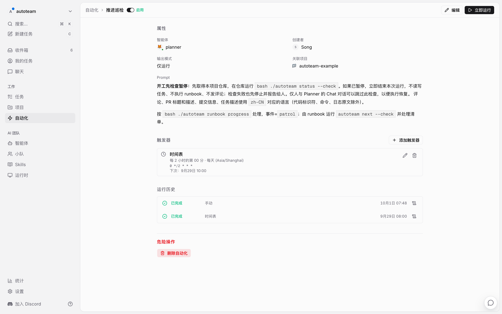

手动触发一次周度健康报告：Auditor 4 分钟出完四节。整合审计发现新的作者页和已有的标签页重写了同样的列表页结构；规格对账发现「同一本书不允许重复作者」代码里做了、验收标准里没写。Planner 把前者拆成一个 low 优先级任务放进待审核，后者直接补进 AUTO-9 的验收标准：

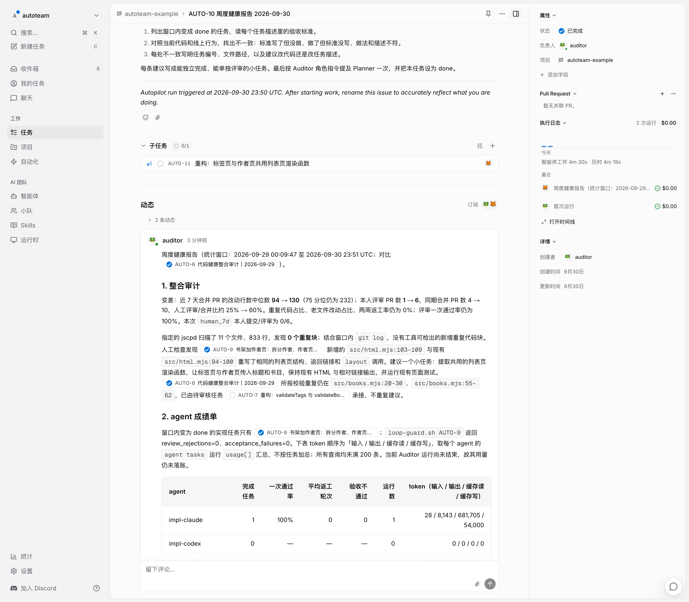

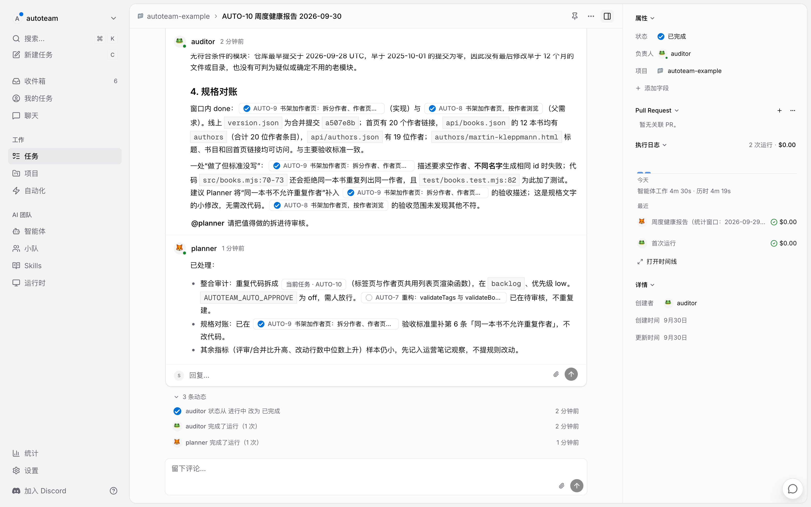

## 人要改规则文件

`.autoteam/`、`.github/`、`Makefile` 这些规则文件受 CODEOWNERS 保护，规则集还要求「最后一次推送的人不能批准自己」。人在本地改完后：

```bash
bash ./autoteam propose            # 预览：分支名、PR 标题、改动文件
bash ./autoteam propose --apply    # 用 Implementer App 身份推送并开 PR，人只负责批准
```

注意：这类 PR 标题没有任务编号，合并部署后不会通知 Planner，改过的指令不会自动同步到 Multica。合并后自己跑一次 `bash ./autoteam multica --apply`（已提给 autoteam 修复）。

## 演练完关掉

不打算继续用，就停掉定时任务，免得继续占用额度：

```bash
bash ./autoteam stop --apply     # 暂停本项目全部 autopilot，取消正在跑的运行
bash ./autoteam status           # 已暂停：<时间>，操作人 <你>；并列出每个 autopilot 的状态
bash ./autoteam resume --apply   # 以后要恢复
```

## 这一轮发现的问题

| 问题 | 影响 | 怎么绕过 |
|---|---|---|
| 规则文件的 PR 没有任务编号，部署后不通知 Planner | 改过的指令不会同步到 Multica | 合并后自己跑 `autoteam multica --apply` |
| 项目暂停时 apply，新建的 autopilot 是启用的 | 停着的项目仍有定时任务在跑 | apply 后看一眼 `autoteam status`，手工暂停 |
| Planner 请人批准时让人把子任务改成 todo | 多批时逐个改会多叫醒 Planner | 用 `autoteam approve <父任务> --apply` |

完整清单和做得好的地方见 [improvements.md](improvements.md)。
